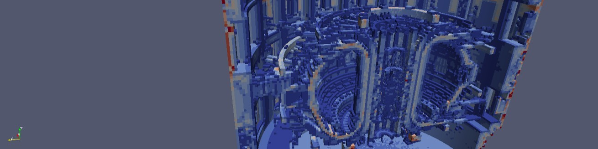

# iWW-GVR: A tool to manipulate MCNP weight window (WW) and to generate Global Variance Reduction (GVR) parameters

The tool is a Python 3.7 based package that can load, manipulate and write MCNP weight-windows
as well as generate GVR files from meshtally files. The tool can also export the WWs or GVRs
to a VTK format that can be read with other codes like Paraview.

The tool can be used by means of a command line interface or by importing the WW class in 
custom user scripts or Jupyter Notebooks. The tool accepts meshes and WW in cartesian and 
cylindrical coordinates.

# Installation
The user can download this project from the main folder that contains the setup.py file the 
package can be installed via pip:
> pip install .

This should install all the dependencies and make the tool ready to use in the environment 
where it was installed.

# How to use
Once installed the tool can be started by executing the command:
> python -m iww_gvr

Then the command line interface will start-up and prompt the user with several commands like
reading a WW file, adding or removing particle types, applying normalization factors to the
values, mitigating the long history particle problem, exporting the WW to a VTK file...

# Alternative use
This tool is built as a package that the user can import in her own Python scripts or 
programs. Inside a new Python script the user may write:
> from iww_gvr import WW\
> my_ww = WW.read_from_ww_file('path/to/ww_filename')

Now the user has access to the main functionality of the tool. The WW class has many 
interesting public methods and attributes, writing help(WW) will provide information on them.

# LICENSE
Copyright 2019 F4E | European Joint Undertaking for ITER and the Development of Fusion 
Energy (‘Fusion for Energy’). Licensed under the EUPL, Version 1.2 or - as soon they will
be approved by the European Commission - subsequent versions of the EUPL (the “Licence”).
You may not use this work except in compliance with the Licence. You may obtain a copy of
the Licence at: http://ec.europa.eu/idabc/eupl.html   
Unless required by applicable law or agreed to in writing, software distributed under
the Licence is distributed on an “AS IS” basis, WITHOUT WARRANTIES OR CONDITIONS OF ANY KIND,
either express or implied. See the Licence permissions and limitations under the Licence.

[src]: https://github.com/Radiation-Transport/iWW-GVR
